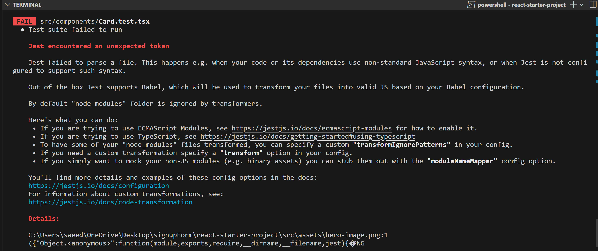
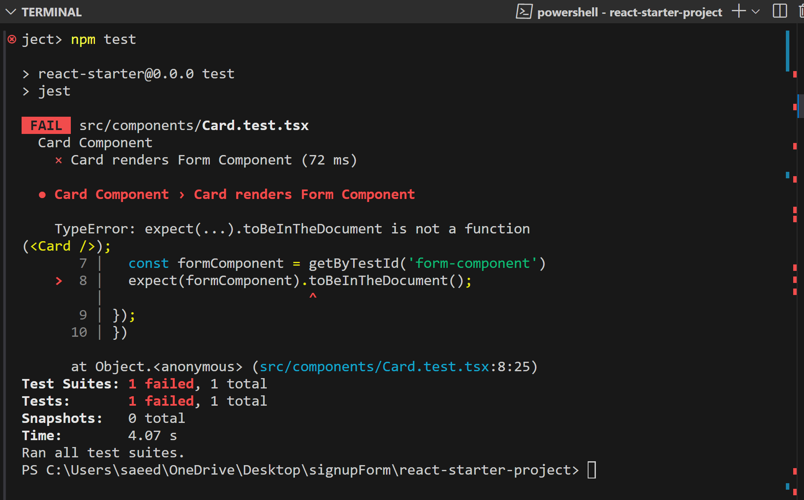

# Sign up Form

This is a responsive sign up form built using React, TypeScript, and Tailwind CSS. The form includes real-time validation, error handling, and a simple login simulation using hardcoded credentials. It also features automated testing with Jest and React Testing Library.

Live [Site](https://as-singnup-form.netlify.app/).
Github [Repo](https://github.com/aimansae/react-signup-form).


## Table of Contents

- [Features](#features)
- [Requirements](#requirements)
- [Challenges](#challenges)
- [Technologies Used](#technologies-used)
- [Getting Started](#getting-started)
- [Styling With TailwindCSS](#styling-with-tailwindcss)
- [Testing & Troubleshooting](#testing--troubleshooting)
- [Deployment](#deployment)
- [Future Features](#future-features)
- [Additional Info and Resources](#additional-info-and-resources)
- [Acknowledgements](#acknowledgements)

## Features

- Input validation for email and password fields
- Real-time error display below each input
- Simulated login using hardcoded credentials
- Responsive design (mobile-friendly)
- Styled with Tailwind CSS
- Automated tests using Jest and React Testing Library

## Requirements:

- Use the provided React starter project to kick-start development.
- Set up Tailwind CSS or your preferred styling tool.
- Implement a responsive signup form with input validation.
- Display form errors gracefully beneath inputs.
- Simulate login with a hardcoded username/password combo and show a success message.
- Show an error for all other credentials.
- Make sure the form works on mobile and desktop.
- Write tests — no excuses!

**Time Limit: 8 hours**

## Challenges

1. Real-Time Input Validation with Multiple Rules

Creating dynamic validation for all fields (username, email, password) was tricky, especially when combining multiple rules like length, pattern, and emptiness checks.

**Example**:  
To ensure that the username field only accepts letters and is at least 3 characters long, I used this logic:

```bash
if (!formValues.username.trim()) {
  displayErrors.username = 'Username is required';
} else if (formValues.username.length < 3) {
  displayErrors.username = 'Minimum 3 characters required';
} else if (!/^[a-zA-Z]+$/.test(formValues.username)) {
  displayErrors.username = 'Only Letters are allowed';
}
```
This pattern was repeated for email and password with different validation rules.

2. Controlled Form State with Error Handling
Managing multiple pieces of form state (formValues, errors, showMessage) made the component logic complex. I had to ensure that form reset, submission, and error messages didn't conflict with each other.

Key Concept: I used useState to keep each piece of form data and errors separately, updating them based on validation or submit events.

3. Showing Error Messages Dynamically Below Inputs
Each input needed to show errors only when invalid, and those errors had to disappear when corrected. This meant wiring each input to display its corresponding error in real-time.

Example:
Passing error props into the reusable Input component:

```bash
<Input
  label="Username"
  onChange={handleChange}
  value={formValues.username}
  name="username"
  error={errors.username || null}
/>
```
Inside Input.tsx, conditional rendering showed the error message when the error prop was not null.

4. Writing Tests for Error and Success States
Testing edge cases like invalid emails, short passwords, and empty fields required simulating user interactions.

I also faced issues with missing toBeInTheDocument():

Fix: Installed @testing-library/jest-dom and configured jest-setup.ts:

```bash
// jest-setup.ts
import '@testing-library/jest-dom';
```
Included it in tsconfig.json and referenced it properly.

5. Resolving Image Import Issues in Tests
Jest threw errors on image imports during test runs:

```bash
 
SyntaxError: Unexpected token when importing image asset
```
Solution:

Created a mock file: __mocks__/imageMock.js

module.exports = 'test-file-stub';
Mapped image extensions in package.json:

```bash
"jest": {
  "moduleNameMapper": {
    "\\.(jpg|jpeg|png|gif|svg)$": "<rootDir>/__mocks__/imageMock.js"
  }
}
```
6. Form Submission Logic with Simulated Success State
Simulating a login success (without backend) was harder than expected. I had to toggle UI states using setShowMessage(true) and reset all inputs cleanly after a successful login.

```bash
if (formIsValid) {
  setShowMessage(true);
  setSubmittedData(formValues);
  setFormValues({ username: '', email: '', password: '' });
}
```
This added complexity to both validation and UI behavior.

7. Mobile-First Responsive Styling with Tailwind
Making the form responsive across screen sizes was harder with nested components. I had to use max-w, sm:, and md: classes precisely to ensure layout worked well on small devices.

Bonus Challenge:
Learning how to use Tailwind's utility classes for vertical spacing and alignment without breaking accessibility or responsiveness.

These challenges helped deepen my understanding of form validation, component communication, React state management, and testing in TypeScript projects.

## Technologies Used

- [React](https://reactjs.org/) – JavaScript library for building user interfaces
- [TypeScript](https://www.typescriptlang.org/) – Adds static typing to JavaScript
- [Tailwind CSS](https://tailwindcss.com/docs) – Utility-first CSS framework for rapid UI styling
- [Vite](https://vitejs.dev/) – Fast frontend build tool
- [Jest](https://jestjs.io/) – JavaScript testing framework
- [React Testing Library](https://testing-library.com/docs/react-testing-library/intro/) – Helps test UI components the way users interact
- [User Event](https://testing-library.com/docs/user-event/intro/) – Simulates user interaction in tests
- [Prettier](https://prettier.io/) – Code formatter
- [Prettier Plugin for Tailwind](https://tailwindcss.com/blog/automatic-class-sorting-with-prettier) – Automatically sorts Tailwind classes


## Getting Started
1. Clone the Starter Project
```bash
git clone https://github.com/aimansae/react-starter-project.git
cd react-starter-project
npm install
npm run dev
2. Push to New Repository

git remote remove origin
git remote add origin https://github.com/yourusername/react-signup-form.git
git add .
git commit -m "Initial commit"
git push -u origin master
```

### Styling With [TailwindCSS](https://tailwindcss.com/docs/guides/vite)

- Install tailwind:
  npm install tailwindcss@latest postcss@latest autoprefixer@latest

- Create tailwind.config.js file:
  npx tailwindcss init

- Add content to tailwind.config.js file:
  './src/\*_/_.{js,jsx,ts,tsx}'

- Download extension Tailwind CSS IntelliSense

**For better development experience, as per
mentor's advice**

- [Installed Prettier plugin](https://tailwindcss.com/docs/editor-setup#automatic-class-sorting-with-prettier)
- [Created custom theme](https://tailwindcss.com/docs/theme)
- [Added custom classes](https://tailwindcss.com/docs/adding-custom-styles)

### Prettier [Setup](https://github.com/tailwindlabs/prettier-plugin-tailwindcss):

npm install -D prettier prettier-plugin-tailwindcss

Create .prettierrc file in root directory and add configuration:
{
"semi": true,
"tabWidth": 2,
"printWidth": 100,
"singleQuote": true,
"trailingComma": "none",
"jsxBracketSameLine": true,
"plugins": ["prettier-plugin-tailwindcss"]
}

## Testing &  Troubleshooting

While running tests encountered the following paring error for focusImage




**Fixed** by installing:
npm install --save-dev jest-transform-stub

    include transformer for images in package.json file:
      "transform": {
    "^.+\\.tsx?$": "ts-jest",
    "^.+\\.(jpg|jpeg|png|gif|svg)$": "<rootDir>/node_modules/jest-transform-stub"

}

Solution did not work

1. Created a \_ _mocks_ \_ directory with imageMock.js file in it:
   module.exports = "test-file-stub";

2. Removed jest.config.cjs file, add the configuration under Jest in package,json file:
   "jest": {
   "moduleNameMapper": {
   "\\.(jpg|jpeg|png|gif|svg)$": "<rootDir>/**mocks**/imageMock.js"
   }
   }

While running test for Card Component faced the following error:


**Fixed**:

toBeInTheDocument is not part of RTL. Need to install [jest-dom](https://github.com/testing-library/jest-dom/) to enable it.

    npm install --save-dev @testing-library/jest-dom

With TypeScript, setup file is a .ts and not a .js .

Include your setup file in your tsconfig.json if you haven't already:

// In tsconfig.json
"include": [
...
"./jest-setup.ts"
],  
And then import it in your test files by:

import '@testing-library/jest-dom'

To install user event:
npm install --save-dev @testing-library/user-event @testing-library/dom

## Deployment

The app is deployed using [Netlify](https://as-react-signup-form.netlify.app/)

Make sure to add a netlify.toml if you have a custom build setup:

```bash

[build]
command = "npm run build"
publish = "dist"

```

## Future Features

- Form success message modal with animation
- Disable submit button until validation passes
- Hook form state into a reusable custom hook
- Store form data in localStorage (for offline retry)
- Dark mode toggle
- Integrate with real backend or mock API
- Use react-hook-form for simplified validation
- 100% test coverage

### Additional info and Resources:


- React testing [tutorial](https://www.youtube.com/watch?v=2TkpBziqkRA&list=PLC3y8-rFHvwirqe1KHFCHJ0RqNuN61SJd&index=11)
Jest [Matchers](https://jestjs.io/docs/using-matchers)

- React Testing library [GetByRole](https://testing-library.com/docs/queries/byrole)
[HTML ROLES](https://www.w3.org/TR/html-aria/#docconformance)

- React Testing [Playground Extension](https://chromewebstore.google.com/detail/testing-playground/hejbmebodbijjdhflfknehhcgaklhano)

- [Automatic Classes sorting with Prettier](https://tailwindcss.com/docs/editor-setup#automatic-class-sorting-with-prettier)

- [Spell check extension](https://marketplace.visualstudio.com/items?itemName=streetsidesoftware.code-spell-checker)

## Acknowledgements
Special thanks to my mentor Amal K. , whose guidance, support, and feedback were instrumental throughout this project.Thanks!